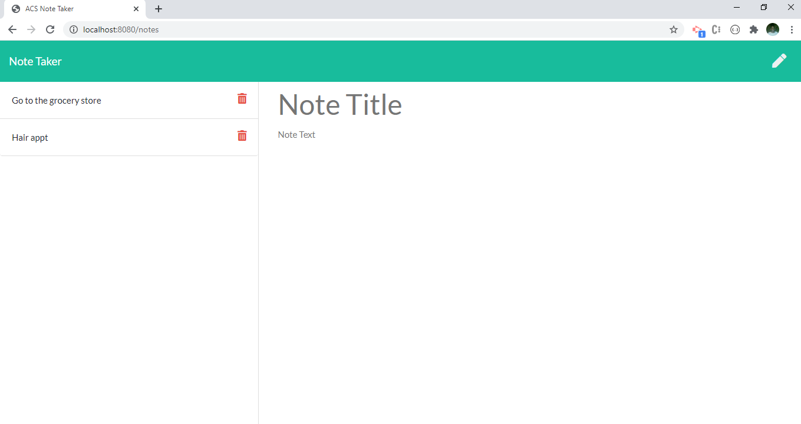
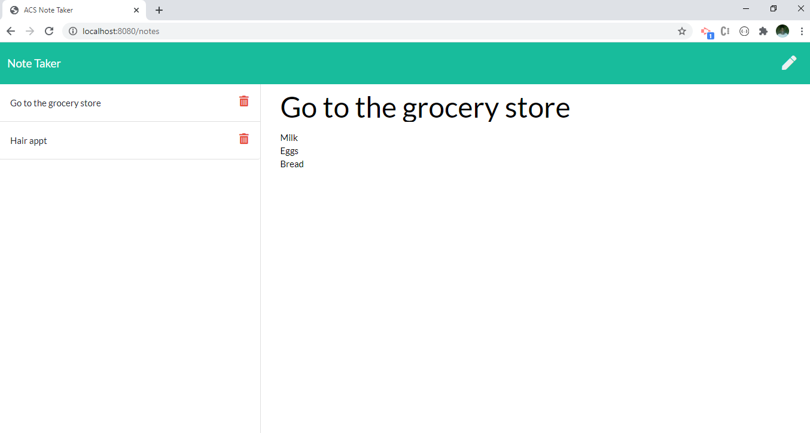
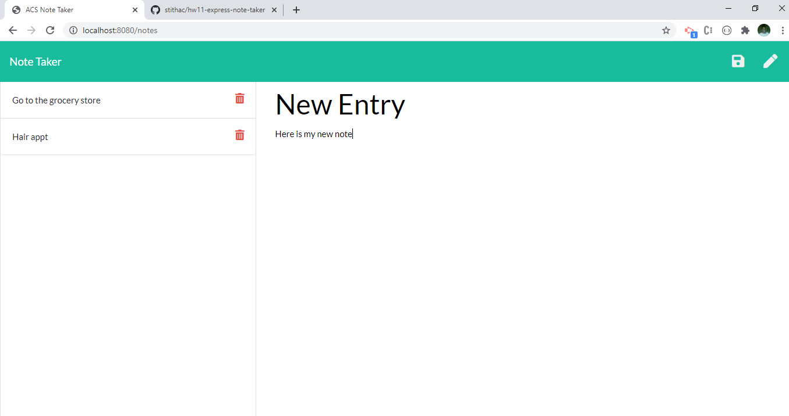

# hw11-express-note-taker, 4 FEB 21

#### By Ashley Stith

## Description
This Application allows users to write and save notes so they can organize thoughts and keep track of tasks.   It uses an Express.js back end and saves/retrieves note data from a JSON file.  When launched, the application opens with a landing page that contains a link to a notes page.  The notes page is where all the magic happens.  Existing notes are listed on the left and empty fields to enter a new note title and text are included on the right.  Each existing note includes a delete button that allows the user to delete the record from the JSON file and the page (**BONUS**).  When a user clicks the title of an existing note, the title and text are displayed in the right-hand column.

## Dependencies
The [Express package](https://expressjs.com/) is used to connect the server and create routes from the back-end to the front-end.

In addition, the [UUID package](https://www.npmjs.com/package/uuid) is used to create unique ids for each of the note items.

The following native node module is also used: fs.

The application is invoked by using the following command:

```bash
node server.js
```
# Notes page (Note: look and feel may be slightly updated since taking the screenshots)


*Note:* The Save button is not displayed unless you enter a title or text into the right-hand column.



*Note:* The above shows the view after clicking an existing entry.



*Note:* As you can see, the save button is included at the top-right.  This is because we creating an entry and the title and text are not blank.

## Installation
* Create a `.gitignore` file and include `node_modules/` and `.DS_Store/`
* Install npm dependencies using the following command:
```bash
npm i
```
## Features
* The application has a *db.json* file that is used to store and retieve notes using the native node `fs` module.
* The application includes the following HTML routes:

    * `GET /notes` returns the `notes.html` file.
    * `GET *` returns the `index.html` file.

* The application includes the following API routes:

    * `GET /api/notes` reads `db.json` file and return all saved notes as JSON.
    * `POST /api/notes` receives a new note to save on the request body, adds it to the `db.json` file, and then returns the new note to the client.
    * **BONUS** `DELETE /api/notes/:id` deletes the request id from the json file and front-end.

## Known Bugs
Site has no known bugs

## Technologies Used
* node.js
* express.js
* UUID.js
* Bootstrap

## Contribution Guidelines
Direct link to repository: https://github.com/stithac/hw11-express-note-taker


